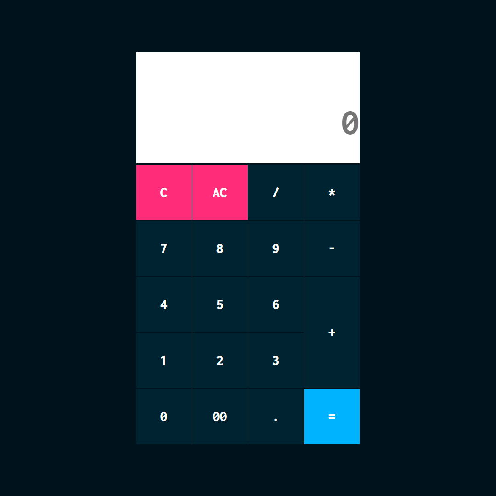

# Calculadora com JavaScript - PURO
 Repositório criado para compartilhar uma calculadora Web com HTML, CSS e JavaScript. 
 Este projeto está sendo desenvolvido para fins de estudo pessoal, da linguagem de programação JavaScript (puro).

 